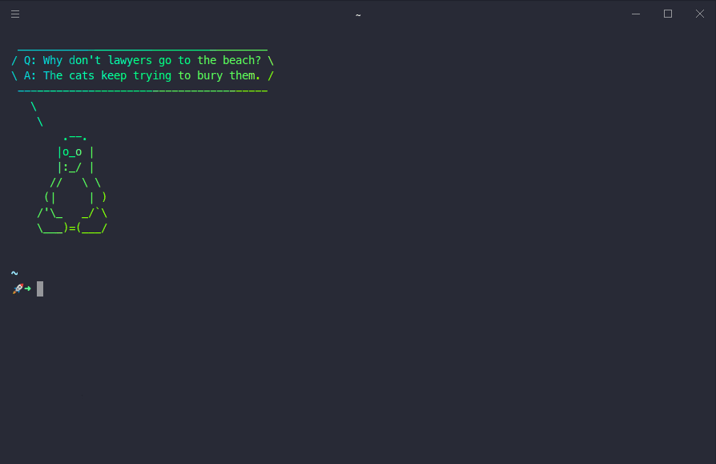
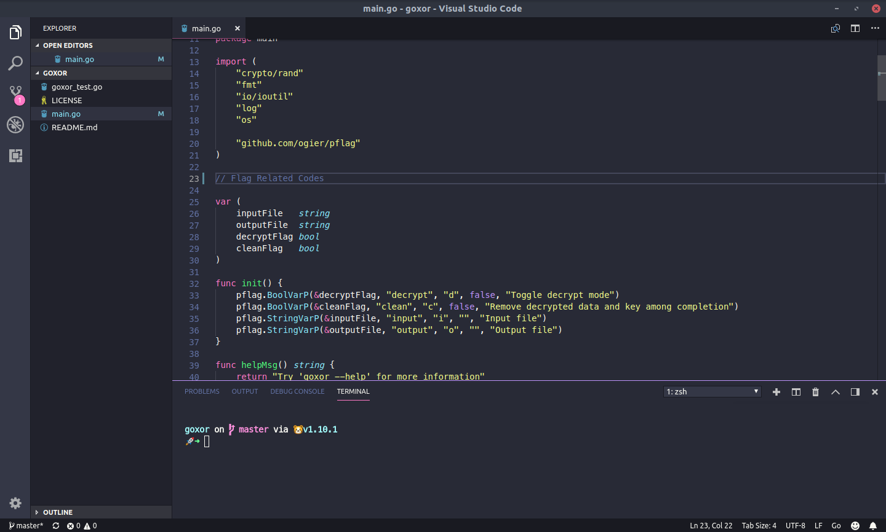

# Jorge's dotfiles

These dotilfes are how I like to use my machine, which is typically a copy of arch with the budgie desktop enviroment, or Ubuntu Bugdie (:

The master branch contains my latest setup, if my setup is to drastically change in any way, the current setup will become it's own branch and the new setup will become the master branch

### Supported Software
| Tool/Program 	| Associated config file(s)       	| Config Dependencies                                                                                                                                                      	|                            Config Description                           	|
|--------------	|---------------------------------	|--------------------------------------------------------------------------------------------------------------------------------------------------------------------------	|:-----------------------------------------------------------------------:	|
| zsh          	| .zshrc                          	| antibody, cowsay, fortune-mod, lolcat                                                                                                                                              	| Sets prompt, some aliases, sets GOPATH, sets PATH 	|
| hyper        	| .hyper.js                       	| [This font](https://github.com/powerline/fonts/blob/master/Meslo%20Dotted/Meslo%20LG%20M%20DZ%20Regular%20for%20Powerline.ttf), and an emoji font (I use ttf-noto-emoji) 	|                           Sets font and style                           	|
| VS Code      	| .config/Code/User/settings.json 	| Same font dependencies as hyper, Dracula Theme for VS Code (Install in vscode)                                                                                           	| Sets font, style,and a couple editor preferences                        	|
### Cherry-Pick Installation 
1. Download and install `git` for your system
2. Clone this repo using `git`
```shell
git clone https://github.com/penguingovernor/dotfiles.git
```
3. Go into the directory using `cd`
```shell
cd dotfiles
```
4. This repo is meant to emulate your $HOME directory that is, the root of this directory should correspond with $HOME of your machine
    1. Symlink the associated config file to it's place in the filesystem

    Example:
    ```shell
    # Assuming that you are in the root of this repo
    ln -s .zshenv $HOME/.zshenv
    ```

### Automated Install - All Config Files Copied Over
* Coming Soon

### Screenshots

#### Zsh + Hyper


#### VS Code


### Project Roadmap
- [x] ~~My VS Code config~~
- [ ] My pacman.conf config
- [x] ~~My terminal config~~
- [ ] Automated Install for debian and arch based systems
- [x] ~~Add screenshots to readme~~